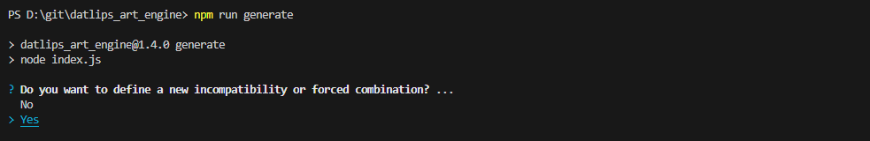
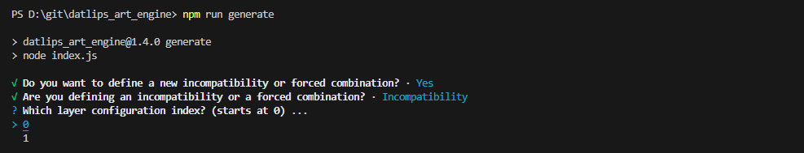
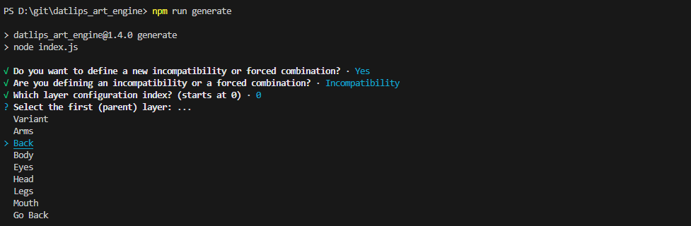
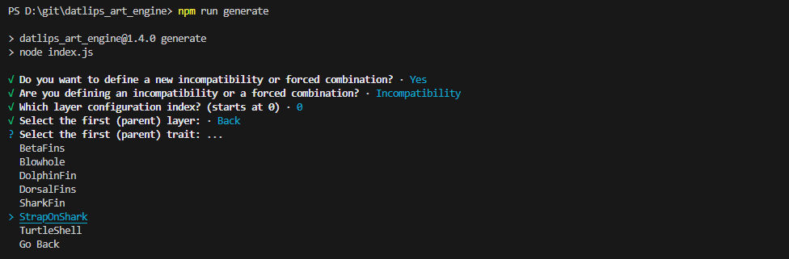
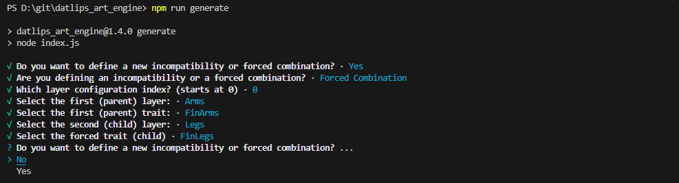
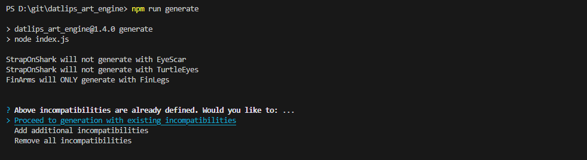

This is a fork of Hashlip's art engine with several additional features and quality of life changes

🛠️🛠️ More features being added 🛠️🛠️

<br/>
If you have any questions, please feel free to ask me in the various channels I can be reached (Discord will be the most consistent)
<br/>


## [Relevant links / socials](https://linktr.ee/datboi1337)

---

# Installation notes
Use Node 20.xx.xx

# General use
0) (first time) run `npm install`
1) Remove existing folders in `layers` folder, and replace with your layer folders
2) Define `collectionSize` in config.js
3) Define `network` in config.js (set to ETH by default, which should work for most EVM chains)
4) Define general metadata (and solanaMetadata of generating for Solana)
5) Update layerConfigurations in config.js. Be sure to define them in the order they are to be selected. First definition is the 'bottom' or 'back' of the image. 
6) Run generation with `npm run generate`
7) Follow prompts to define any incompatibilities or forced combinations
8) Review metadata once it's been generated, and follow the prompts to generate images if metadata is generated to your specification. 

### Planned upcoming features coming soon

[Track current progress and see upcoming features on the project's Trello board](https://trello.com/b/PsInWbHr/datlips-art-engine)

- Adding terminal interaction for most metadata manipulation utilities to avoid direct script editing


# Enhanced Features in this fork
---
## More efficient generation
- [Split metadata and image generation](#split-metadata-and-image-generation)

## GIF generation
- [Generate GIFS and/or PNG](#generate-gifs)
  - [GIF example](#gif-example)

## 1 of 1 metadata generation
- [Generate metadata for non-generated images](#oneofone)
- [oneOfOne example](#oneofone-example)

## IPFS Upload
- [Upload images and metadata directly from terminal](#ipfs-upload)
  - [IPFS upload examples](#ipfs-upload-examples)


## Conditional generation
- [Guided wizard for setting incompatible traits and forced combinations](#compatibility-wizard)
  - [Incompatibility example](#incompatibility-example)
  - [Forced combinations example](#forced-combination-example)
  - [Bulk incompatibility entry (bulk)](#advanced-compatibility)

## Additional network selections
- [Metadata standard output for Ethereum, Solana, and SEI](#network-selection)

## Opensea Drop output
- [Opensea drop metadata CSV output](#opensea-drop-csv-output)

## Named rarity weight
- [Use named weights instead of numbers in filename](#use-named-weight-instead-of-filename)
  - [Named weight example](#named-weight-example)

## Exact rarity weight

- [Set trait weight to equal the exact number of times you want that trait in the collection rather than using rng](#use-exact-weight-instead-of-rng)
  - [Exact weight example](#exact-weight-example)

## ~~Layer Variation~~ Conditional Parents
**NOTE:** Layer Variation system will be depreciated in favor of the new [conditional parents](#conditional-parents) system. It will still function for now. 
- OLD - [Assign layer variations to ensure layers with that variation match eachother](#layer-variation-system)
  - [layer variation example](#layer-variation-example)
- NEW - [Conditional parents](#conditional-parents)
  - [Conditional parent example](#conditional-parent-example)

## SubTrait options for granular control
- [Assign advanced subTraits with independant image control options like blend, opacity, and Z-Index](#subtrait-options)
  - [subTrait examples](#subtrait-examples)

## Z-Index system
- [Override layerOrder with Z-Index](#z-index)
  - [Z-Index examples](#z-index-examples)

## Exclude layer option
- [Exclude layer from metadata](#exclude-layer-from-metadata)

## Add stat blocks
- [Assign randomized stats within defined range to each NFT!](#stat-blocks)
  - [Stat blocks examples](#stat-block-examples)

## Add extra attributes
- [Add extra attributes to every NFT](#extra-attributes)
  - [Extra attributes example](#extra-attributes-example)

## Resume creation
- [Generate NFT in stages](#generate-nft-in-stages)
  - [resumeNum example](#resumenum-example)

## Allow duplicate images/metadata
- [Allow duplicate images to be duplicated](#allow-duplicates)

## Define DPI in format
- [Define DPI in addition to resolution](#define-dpi)

## Individual name and description per layer configuration
- [Assign unique name and description per layer configuration](#unique-name-and-description)

## Set layer configurations to desired size
- [set growEditionSizeTo per layer configuration, instead of cumulatively](#non-cumulative-growEditionSizeTo)
  - [growEditionSizeTo example](#growEditionSizeTo-example)

## Backup, Cache, Archive, & Restore
- [Generation, edits, and past collections will be saved and can be restored](#restoration-system)
  -[Restore example](#restore-example)
- [Archive past collections and reset engine](#archive-system)
  - [Archive example](#archive-example)

## Exclude traits from metadata
- [Define any traits that should not be included in metadata](#exclude-traits-from-metadata)

## Misc. Utils
- [cleanMetadata](#cleanmetadata)
- [removeAttributes](#removeattributes)
- [renameAttributes](#renameattributes)
- [generateOldDna](#generateolddna)
- [recreateAndSortMetadata](#recreateandsortmetadata)
- [rarityFromMetadata](#rarityfrommetadata)
- [createOpenseaCSV](#create-opensea-csv)

---

# Split metadata and image generation
All metadata will be generated immediately upon running `npm run generate`. This allows generation to happen much faster, and provides a trait breakdown in the terminal upon completion, with a prompt to continue to photo generation. Any issues with metadata/compatibility can be seen and rectified much faster, then when all is well, image generation can take place. 


**NOTE**: Your most recent generation is cached in build/json/_imgData.json. You can regenerate images again with the command `npm run generate_photos`. This is especially useful when a trait needs to be edited, since you can regenerate the images without needing to *also* regenerate the metadata. 

# Generate GIFs
GIF generation is now supported! You can use either .gif or .png trait files to generate images. In it's current implementation, .gif scaling isn't well supported, so be sure to set your trait .gifs to the size you intend your final NFT to be, and set `format.width` and `format.height` to that resolution.
Mixed use is possible. So if you want to have some .png layers and some .gif layers, the engine should layer the .png into a final .gif. 
All layer options (subTraits, etc.) are compatible with .gif traits. 

# GIF example
Place .gifs in layer folders like you would .png. 

Setup layer configuration the same way as .png images
```js
{
  growEditionSizeTo: 12, // This will generate 12 images with this layersOrder
  namePrefix: collectionName,
  description: description,
  layersOrder: [
    { name: "Background" },
    { name: "Body" }, // .png layer example
    { name: "Skin" }, 
    { name: "Outfit" },
    { name: "Face" }, 
    { name: "Hair" },
    { name: "Action", options: {
      conditionalOn: [ "Skin", "Outfit" ],
    } },
  ],
},
```
Setup `gif` in config.js to match your desired settings. These should typically match your source .gif settings, but will render whatever you enter here. 
```js
const gif = {
  numberOfFrames: 60,
  repeat: 0, // Infinite loop
  quality: 100,
  delay: 40,
};
```
**NOTE:** .gif files that contain fewer frames will be spread over the `numberOfFrames`. If `numberOfFrames` is set to 60 and one .gif has only 2 frames, it will play the first frame for the first 30 frames, and the second frame for the last 30 frames. 
Individual traits:

This example adds a .png layer for demonstration
 
The engine will temporarily extract individual frames from each gif and store them in a 'temp_frames' folder in the same directory as the trait .gif. After image generation, you will be prompted to either clear or keep these files. 


# OneOfOne
When images don't need to be generated because the collection is all 1 of 1, this system can be enabled. Because the images do not require generation, this system will only generate metadata. 
**NOTE:** Images must be placed in a folder called 'oneOfOne' like so: `./layers/oneOfOne`
**NOTE:** Images must be named with numbers (ie: 1.png, 2.png, etc.). oneOfOne does not require weight, and should not define weight in the filename. 
**NOTE:** It's recommended to upload the images to IPFS first so you can enter the CID into  baseURI in config.js before metadata generation. You can use the [IPFS upload system in this engine if you have a Thirdweb API key](#ipfs-upload)

# OneOfOne example
Set `oneOfOne` to true in config.js. 
```js
const oneOfOne = true;
```
Setup layerConfiguration to only reference oneOfOne folder:
```js
{
  growEditionSizeTo: 100,
  namePrefix: collectionName,
  description: description,
  layersOrder: [
    { name: "oneOfOne", options: { displayName: "Unique Art"} },
  ],
},
```
**NOTE:** This will generate metadata only. There will be only one attribute with a value like 'Collection Name # Edition / Collection Size' 
```
{
  "trait_type": "Unique Art",
  "value": "Your Collection #1/100"
},
```

# IPFS Upload
To use IPFS upload, you must obtain a Thirdweb API key. Please be sure to review [Thirdweb storage policy](https://portal.thirdweb.com/infrastructure/storage/overview) for more information and costs. 
Once you've aquired an API key, copy 'env.example' and rename it '.env'. Replace 'yourKeyHere' with your Thirdweb secret key
```js
THIRDWEB_SECRET_KEY=yourKeyHere
```

# IPFS Upload examples
This command has two options for uploading images from `./build/images` and metadata from `./build/json` unless generating metadata for a [1 of 1](OneOfOne) collection, in which case it would upload images from `./layers/oneOfOne`. 
`npm run upload images`

`npm run upload metadata`

**NOTE:** Be sure to update `baseUri` value in config.js with image CID from terminal after running `npm run upload images`. Then, run `npm run update`. Then, with metadata updated with image CID, you can run `npm run upload metadata`

# Compatibility Wizard
You will be prompted in the terminal for any incompatibilities in your collection when running generation. Incompatible traits must be defined by first selecting the item that will be selected first in the layersOrder, then choosing a trait that will be selected after the first. The incompatibility wizard will only allow you to select options that appear *after* the first trait. 
**NOTE:** Most interactions will include a 'Go Back' option, which should allow you to re-select the previous selection or start over. 

# Incompatibility example
With the default layers in this fork, we can define the following incompatibilities (arbitraily chosen for demonstration): `Back/StrapOnShark` (parent) is not compatible with `Eyes/EyeScar` and `Eyes/TurtleEyes`. We can tell the engine not to generate those items together like so:
<br/>

1) When running `npm run generate`, you will be prompted whether you want to input any incompatible layers. 

2) Select Incompatibility

3) Select layer configuration index (only applicable if multiple layer configurations are defined in config.js). If incompatibility applies to all layers, select the first layer configuration. You will be prompted later to apply incompatibility to all layers if needed. 

4) Select the layer your *parent* trait is located in 

5) Select the parent trait

6) Select the layer your *children* traits are located

7) Select the children trait(s), using the space bar to select traits, and enter to confirm

8) Dictate whether defined incompatibility should be universal (applied to ALL layer configurations)

8) Engine will mark incompatitbilities and prompt you to enter any other incompatibilities or forced combinations.


# Forced combination example
We can define the following forced combination (again, arbitraily chosen for demonstration): `Arms/FinArms` must only ever generate with `Legs/FinLegs`. We can tell the engine to always generate those items together like so:
<br/>

1) When running `npm run generate`, you will be prompted whether you want to input any incompatible layers. 

2) Select Forced Combination

3) Select layer configuration index (only applicable if multiple layer configurations are defined in config.js)

4) Select the layer your *parent* trait is located in 

5) Select the parent trait

6) Select the layer your *child* trait is located in

7) Select the child trait. **NOTE:** Forced combinations can only have one child trait, as these two traits will be linked and will not generate with ANY other traits. 

8) Engine will mark forced and prompt you to enter any other incompatibilities or forced combinations.


**NOTE**: Incompatibilities and forced combinations are not lost in cases where generation needs to be run again. If you've previously run the compatibility wizard or incompatibilities have been defined manually (see Advanced incompatibility below), you will be prompted to review existing incompatibility counts, then asked to either proceed with generation, add more incompatibilities, or remove all incompatibilities to start fresh (you will be prompted to add incompatibilities again, if needed).



# Advanced compatibility
If you need to define multiple incompatibilities/forced combinations, and you don't want to use the wizard, you *can* define them manually by editing compatibility/compatibility.json, adding an object like the example below defining all the incompatibilities and forced combinations from above. 
**NOTE** This should really only be used by advanced users. If this is defined incorrectly, it's possible to experience generation issues.

```js
{
  "EyeScar": { // child trait. second selected incompatible / forced trait
    "2": { // parent index. There can be multiple, so it's defined as a key
      "incompatibleParents": [ // incompatible parents. 
        "StrapOnShark"
      ],
      "parents": [             // compatible parents
        "BetaFins",
        "Blowhole",
        "DolphinFin",
        "DorsalFins",
        "SharkFin",
        "TurtleShell"
      ],
      "parentIndex": 2,        // layersOrder index of parent layer
      "childIndex": 4,         // layersOrder index of child layer
      "layerIndex": 0,         // layerConfiguration index
      "maxCount": 0,           // This will be calculated later, should always be 0 by default
      "forced": false,         // false for incompatibility
      "universal": false       // false because it does not apply to all layer configurations
    }
  },
  "TurtleEyes": {
    "2": {
      "incompatibleParents": [
        "StrapOnShark"
      ],
      "parents": [
        "BetaFins",
        "Blowhole",
        "DolphinFin",
        "DorsalFins",
        "SharkFin",
        "TurtleShell"
      ],
      "parentIndex": 2,
      "childIndex": 4,
      "layerIndex": 0,
      "maxCount": 0,
      "forced": false,
      "universal": false
    }
  },
  "FinLegs": {
    "1": {
      "incompatibleParents": [ // incompatible parents. in this scenario,
        "BetaArms",            // all but one are marked incompatible because 
        "FidlerClaws",         // this is a forced combination
        "LobsterClaws",
        "LureArms",
        "NemoFins",
        "TentacleArms",
        "TurtleArms"
      ],
      "parents": [
        "FinArms"
      ],
      "parentIndex": 1,
      "childIndex": 6,
      "layerIndex": 0,
      "maxCount": 0,
      "forced": true,          // true for forced combinations
      "universal": false
    }
  }
}
```

# Network selection
This fork will generate metadata for Ethereum, Solana, and SEI. Most EVM chains follow Ethereum metadata standards. Please be sure to define all General metadata in config.js, as well as `solanaMetadata` if generating for Solana. 
```js
const network = NETWORK.eth; // EVM chains
const network = NETWORK.sol; // Solana
const network = NETWORK.sei; // SEI
```
**NOTE**: When network is set to to either sol or sei, build/assets will be populated with all json and image files for easy upload. 

# Opensea drop csv output
If you're using Opensea drops, you can utilize the _metadata.csv file found in build/opensea-drop and the images in build/images to upload directly in Opensea studio. The csv file is formatted for opensea drops, and the individual files in build/opensea-drop/json are simply duplicates of the individual json files without the .json extention in case you're uploading directly with setBaseUri on the Opensea drop contracts.  

# Use named weights instead of numbers in filename
This fork gives the option to use a simpler weight system by using common rarity names (Common, Uncommon, Rare, Epic, Legenedary, and Mythic) instead of numbers. Weight will be calculated based on named value. Please reference `rarity_config` in config.js for more detail. The values in `rarity_config` can be edited, if needed. 

## Named weight example


```js
const rarity_config = {
  Mythic: 1,
  Legendary: 6,
  Epic: 15,
  Rare: 31,
  Uncommon: 56,
  Common: 100,
};
```
You can view `rarity_config` in config.js to understand the differences between rarities. Something marked 'Common' will appear 100x more than something marked 'Legendary'. **NOTE**: Even with such a difference between two traits, all traits will be generated at least once. 

# Use exact weight instead of rng
This fork gives the option to use define exact counts of traits rather than using weight to randomly determine counts of traits. 

## Exact weight example
To use exact weight system, set `exactWeight` to true in config.js. When this option is enabled, the weight of any given trait is set to will be the exact number of times that trait appears in the collection. ie: `trait#50.png` will appear exactly 50 times throughout the layer configuration it's found within. <br/>

**NOTE**: All weights in a given folder must add up to the layer configurations `growEditionSizeTo`! Traits with the same names across multiple layersOrders will be counted separately!

```js
const exactWeight = true;
```

# Layer variation system
**NOTE:** Layer Variation system will be depreciated in favor of the new [conditional parents](#conditional-parents) system. It will still 
Use this option to assign a 'variation' to multiple layers. The most common use-case for this option would be ensuring certain traits are the same color or skin pattern. To use the layer variation system, define a layer called 'Variant' in your layer configuration. Populate the 'Variant' folder with blank png, named and weighted according to your variants. Next, create folders in each trait folder where you want the variation applied, and name them after relevent variants. The engine will select a variant, then any trait chosen will adhere to that variant if possible. 
**NOTE** 'Variant' is a restricted layer name. If your collection needs a layer called 'Variant', please be sure to name the folder something else and use the `displayName` option to name your layer appropriately. <br/>
**NOTE** If using the variant system, 'Variant' *must* be the first defined layer. <br/>
**NOTE** If a chosen trait does not have a matching variant, it's default trait file will be rendered in the final image. 

## Layer variation example
In this fork, there are currently two layers with variations (Arms and Head). If you look at the file structure, you will see a Variant folder containing Blue, Green, Purple, and Red blank pngs, and both the Arms and Head folders have nested Blue, Green, Purple, and Red folders containing all traits with compatible variant versions. <br/>
- Base 'Variant' folder:

- Arms Trait folder contents:

- Arms Trait variant (blue) folder contents:

- Arms Trait variant (green) folder contents:

<br/>

For this setup, the layer configuration should look like this. **Please note** that the 'Variant' folder is defined as the first layer, and that it's using the `displayName` option to use the name 'Color' in the final metadata. 

```js
  {
    growEditionSizeTo: collectionSize/2,
    namePrefix: collectionName,
    description: description,
    layersOrder: [
      { name: "Variant", options: { displayName: "Color" } },
      { name: "Arms" },
      { name: "Back" },
      { name: "Body" },
      { name: "Eyes" },
      { name: "Head" },
      { name: "Legs" },
      { name: "Mouth" },
    ],
  },
```

# Conditional Parents
Replacing the current variant system, a layer option, `conditionalOn` has been added that enables setting one or multiple conditional parents. A common use-case for this option would be ensuring certain traits are the same color or skin pattern, but it could be used to set up any traits that have variation depending on selected parent traits. When populating the `conditionalOn` array, be sure to only include layers that come before, and if the layer is dependent on multiple parent traits, be sure to list them *in order*. 
Setting `conditionalOn` enables creating a nested folder structure within the layer folder that must contain any listed parent traits and folders for each of their traits containing variants of the current layer. 
**NOTE:** When using `conditionalOn` system, the FULL folder structure must be created. If there are 5 outfit traits, you must create a folder for each of those 5 outfits. In a scenario where there is only a few conditional traits (rather than all traits in parent layer(s)), incompatibility system should be used instead to mark incompatibilities/forced combinations. 
**NOTE:** Traits are selected from the layer root, then the specific image is rendered based on conditional nested folder structure. Weights should not be present on nested traits, ONLY for the root layer traits. 

# Conditional Parents example
Here's a comparison of how `conditionalOn` works when compared directly to the Variant system
Variant setup:
```js
{
  growEditionSizeTo: 10,
  namePrefix: collectionName,
  description: description,
  layersOrder: [
    { name: "Variant", options: { displayName: "Skin" } }, 
    ...
    { name: "Action" }, // Within the Action folder would be folders for each Variant trait
  ],
},
```
`conditionalOn` setup:
```js
{
  growEditionSizeTo: 10,
  namePrefix: collectionName,
  description: description,
  layersOrder: [
    { name: "Skin" }, 
    ...
    { name: "Action", options: {
      conditionalOn: [ "Skin" ], // Within the Action folder would be a nested folder structure
    } },
  ],
},
```
`conditionalOn` allows more flexibility like assigning multiple conditional parents:
```js
{
  growEditionSizeTo: 10,
  namePrefix: collectionName,
  description: description,
  layersOrder: [
    { name: "Skin" }, 
    { name: "Outfit" },
    ...
    { name: "Action", options: {
      conditionalOn: [ "Skin", "Outfit" ],
    } },
  ],
},
```
Nested folder structure for the above example:
```
layers
|__Skin
  |__Skin 1#Common.gif
  |__Skin 2#Rare.gif
  ...
|__Outfit
  |__Outfit 1#Common.gif
  |__Outfit 2#Rare.gif
  ...
|__Action
  |__Skin
    |__Skin 1
      |__Outfit
        |__Outfit 1
          |__Action 1.gif <<<-----Action 1 that matches Skin 1 and Outfit 1
          |__Action 2.gif <<<-----Action 2 that matches Skin 1 and Outfit 1
          ...
        |__Outfit 2
          |__Action 1.gif <<<-----Action 1 that matches Skin 1 and Outfit 2
          |__Action 2.gif <<<-----Action 2 that matches Skin 1 and Outfit 2
          ...
    |__Skin 2
      |__Outfit
        |__Outfit 1
          |__Action 1.gif <<<-----Action 1 that matches Skin 2 and Outfit 1
          |__Action 2.gif <<<-----Action 2 that matches Skin 2 and Outfit 1
          ...
        |__Outfit 2
          |__Action 1.gif <<<-----Action 1 that matches Skin 2 and Outfit 2
          |__Action 2.gif <<<-----Action 2 that matches Skin 2 and Outfit 2
          ...
  |__Action 1#Common.gif
  |__Action 2#Rare.gif
  ...
    
```
Referencing layers/Action in this repo will show the structure in more detail. Here you can see the available traits when the 'Skin 1' Skin trait and 'Blue Tee' Outfit trait has been previously selected by the engine:

If the 'Skin 3' Skin trait and 'Red Hoodie' Outfit trait were previously selected intead:


# Subtrait options
Subtraits are intended to be utilised when you have parts of a trait that need different options (blend mode, opacity, Z-Index) than it's parent. 

**NOTE**: These traits are not included in the final metadata. 
# Subtrait examples
Good examples of what subtraits are useful for are things like Hat or Hair traits that need to be in front of some elements but behind others, or shadows that need to apply a 50% opacity while the parent trait needs to be full opacity. 

To start, subTraits are created by creating a folder in the layer folder with the same name (**READ**: clean name, without Z-index or weight) as the parent/primary trait directly in the layer folder. Here, you can see multiple folders that have the same clean name as some of the traits. Those four traits all contain subTraits:

The subTraits system will recognize these folders, and include any images within whenever the primary trait is chosen, adhering to any custom options set in config.js. 
### Multiple Z-Indexes 
Consider the skeletal layers in this repo. The Seaweed accessory is meant to show both in front of and behind the fish. 

To achieve this from an art direction point of view, you could edit the seawead trait to be empty in the area where the skeleton is supposed to be:

This works, but can be a little tedious for artists. Instead, we can use the subTraits system and organize the traits like we do in photoshop. Splitting the Seaweed trait into to separate layers:


This way, we can put the part of the Seaweed intended to go behind the fish in the 'Seaweed' folder, and save the primary Seaweed trait in the SkeletalAccessories folder:
**NOTE**: subTrait folder MUST match the name of the primary trait (excluding weight/Z-Index) or else it will not be rendered in the final image. 


Then, we can set config.js like so, being sure to make the zindex lower than the SkeletalAccessories default Z-Index (40 in this case). 
```js
{ name: "SkeletalAccessories", 
  options: {
    subTraits: [
      {
      zindex: 35,
      }
    ]
  } 
}
```
## Different rendering options
Consider the AnglerEyes trait in this repo. It's intended to have a light element, but was originally designed for the light to be a multiply layer:
<br/>

<br/>

<br/>

When exported as a layer, the light element simply looks like this:

To address this, we can use the subTraits system. We add a folder called 'AnglerEyes' to match the primary trait, and add the light element inside it:

The setup our subTraits in config.js like so (I've also added opacity here for demonstration):
```js
{ name: "Eyes",
  options: {
    subTraits: [
      {
      blend: MODE.multiply,
      opacity: 0.5,
      zindex: 35,
      }
    ]
  } 
},
```

## Multiple subTrait options
Now, what if you had a trait that needed multiple different options? For example, let's say the seaweed trait from above also emitted a light:

The Seaweed subTrait folder would now look like this: 

You don't want to blanket assign `blend: MODE.multiply` and `opacity: 0.5`, because then the seaweed behind the fish would also inherit those rules. So to address this, you can assign specific rules to specific subTraits by calling them by name like so:
```js
{ name: "SkeletalAccessories", 
  options: {
    subTraits: [
      {
        name: "Behind",
        zindex: 35,
      },
      {
        name: "Light",
        blend: MODE.multiply,
        opacity: 0.5,
        zindex: 35,
      }
    ]
  } 
}
```
**NOTE**: If blend, opacity, or zindex are left undefined, they will use the primary trait's values

# Z-Index
Manually defining Z-Index allows you to override the layer in which traits are rendered in the final image. By default, each layer is assigned a Z-Index based on it's layersOrder index * 10. 
```js
layersOrder: [
  { name: "SkeletalArms" }, // index 0, default Z-Index 0
  { name: "SkeletalBack" }, // index 1, default Z-Index 10
  { name: "SkeletalBody" }, // index 2, default Z-Index 20
  { name: "SkeletalLegs" }, // index 3, default Z-Index 30
  ...
]
```

## Z-Index examples
Z-Index can be overridden in two ways. First, via the subTraits system. Examples can be seen [here](#subtrait-examples). Second, by prepending the trait file with Z-Index in the format `z##$`. Where `##` is replaced with the desired Z-Index.  

**NOTE**: You can change the Z-Index delimeter from `$` by editing 'zindexDelimiter' in config.js
```js
const zindexDelimiter = "$";
```

# Exclude layer from metadata
If you need to exclude a layer from the final metadata output, you can set the `exclude` option to `true`. In this example, the layer (trait_type) 'SkeletalArms' will not appear in the metadata at all, but will still be rendered in the final image. 
```js
{ name: "SkeletalArms", options: { exclude: true } },
```

# Stat blocks
Add any number of stats to your tokens! All examples are from the [Opensea Metadata Standards](https://docs.opensea.io/docs/metadata-standards). Please visit to see how each display_type will look on Opensea.  

## Stat block examples
To use stat blocks, simply set `enableStats` to 'TRUE' in config.js. 
```js
const enableStats = true;
```
You can randomize the value in each new attribute in `const statBlocks`. You can control the range of the `value` by defining `minValue` & `maxValue`. <br/>
**NOTE**: Leave `value` set to '0' here. If you change it, the generated value may fall outside the range set by `minValue` & `maxValue`.
```js
{
  minValue: 1,
  maxValue: 999,
  attribute:
  {
    display_type: "number", 
    trait_type: "Stamina", 
    value: 0
  },
},
```
The generated trait in the example above will add a trait like this to the metadata:
```js
{
  "display_type": "number",
  "trait_type": "Stamina",
  "value": 84
},
```

# Extra attributes
Allows adding extra *attributes* to the metadata. `extraMetadata` is restricted to only adding things outside the attributes array. This functionality allows adding extra information to the attributes array so they can be displayed in marketplace traits sections. <br/>

**NOTE**: This will add the *same* information to each NFT's metadata. 

## Extra attributes example
This works similarly to the already present `extraMetadata`, but you can add multiple items. Anything added to this section will be added to every NFT's metadata. 
```js
const extraAttributes = [
  {
    trait_type: "New Trait",
    value: "Extra",
  }
];
```

# Generate NFT in stages
This fork gives the ability to start generation at any number. This can sometimes be useful, but in 99% of cases generation should be done all at once. These options simply provide tools for the other 1%. Utilizing a previous generations dna will help to prevent duplicates from being generated. Please be sure to utilize the oldDna [Util](#generateolddna).

## resumeNum Example
`resumeNum` can be set independantly to simply start edition at a higher number, but if you want to use old dna, your `resumeNum` must be set and it must equal the number of items in _oldDna.json

```js
const resumeNum = 0;
const importOldDna = false;
```

# Allow duplicates 
If you want duplicates in your collection, you can set the allowDuplicates flag to true. 
```js
const allowDuplicates = true;
```

# Define DPI 
If you need to adjust your DPI, that has been added as an option in config.js under `format`. 
```js
const format = {
  width: 512,
  height: 512,
  dpi: 72,
  smoothing: false,
};
```

# Unique name and description
`namePrefix` and `description` have been moved to be contained within `layerConfigurations`. This allows separate names and descriptions based on the specific traits being selected.  

# Non cumulative growEditionSizeTo
`growEditionSizeTo` is no longer cumulatively defined. You can now set this number to simply represent the number of images you want generated within that layer configuration. <br/>
**NOTE**: `collectionSize` must be defined, and match the total of your `growEditionSizeTo`s. 

## growEditionSizeTo example
The default setup in config.js demonstrates this system:
```js
const layerConfigurations = [
  {
    // NOTE!! growEditionSizeTo should be set to the number of images you want generate within each layer configuration
    growEditionSizeTo: 50, // << This will generate 50 images with this layersOrder
    namePrefix: collectionName,
    description: description,
    layersOrder: [
      { name: "Variant", options: { displayName: "Color" } },
      { name: "Arms" },
      { name: "Back" },
      { name: "Body" },
      { name: "Eyes" },
      { name: "Head" },
      { name: "Legs" },
      { name: "Mouth" },
    ],
  },
  {
    growEditionSizeTo: 15, // This will generate 15 images with this layersOrder
    namePrefix: `Skeletal ${collectionName}`,
    description: 'Alternate Description for this set of tokens',
    layersOrder: [
      { name: "SkeletalArms" },
      { name: "SkeletalBack" }, 
      { name: "SkeletalBody" }, 
      { name: "SkeletalLegs" }, 
      { name: "SkeletalAccessories", 
        options: {
          subTraits: {
            zindex: 35,
          }
        } 
      }
    ],
  },
];
```

## Restoration System
Certain actions taken in standalone scripts will save backups to ensure restoration in cases where mistakes were made or generation needs to be re-run. 

When running main generation, your most recent 10 runs will be saved in the 'cache' folder. 

When running rename/remove attribute scripts, the original data will be saved in the 'backup' folder, while any edits being made will be applied to the files in the build folder. 

When running the archive script, your layers and src folder will be saved in the 'archive' folder. 

Any of this data can be easily recovered by running `npm run restore` and following the prompts. 

## Restore example
When rurnning `npm run restore`, you will be prompted to restore from backup, cache, or archive. 


After making a selection, you will be prompted for which backup/cache/archive to restore. 

When cache is selected, the cached _imgData will be restored, and all metadata files will be re-created. To generate new images, please run `npm run generate_photos`. 

When backup is selected, any changes made will be reverted, and data from the selected backup will be present in build folder. 

When archive is selected, the layers and src folder will be populated with data from the selected archive. 

## Archive System
The archive system is meant to enable saving whole collection setups. This is useful in cases where you're generating multiple collections, and may need to re-visit something down the line. 

## Archive example
When running `npm run archive`, you will be prompted to archive the collection with the current `collectionName` set in config.js. If you wish to change the name of the folder this will be saved in, you can enter any name when prompted. 'layers' and 'src' folders will be copied, and defaults are restored in the main directory. 


## Exclude traits from metadata
Define any traits that should not appear in the final metadata by writing their clean name (**READ** name without Z-index, weight, or file extenstion) in the `excludeFromMetadata` array in config.js

```js
const excludeFromMetadata = ["None"];
```

Traits defined here will still generate any associated images, but will not appear in the final metadata. 

# Utils

## createOpenseaCSV
This is a standalone script that will create Opensea studio compatible metadata from just the _metadata.json file in the build/json folder. This shouldn't be necessary if generated using the datlips engine, as Opensea studio metadata is already generated in the 'opensea-drop' folder during normal generation. This is useful as a standalone script for collections that may have been generated using a different engine. 

**NOTE** _metadata.json file must be present. 

## cleanMetadata
This utility gives the option to remove some commonly requested items. Set any to true to remove them from generated metadata. Original metadata is preserved in backup folder. <br/>

**NOTE**: These elements are used as keys in other utilities, so please be sure to only run AFTER running any other metadata manipulation utility (rename, update URI, etc.), or be prepared to restore a backup before changing things again.

```js
let removeDna = true;
let removeEdition = false;
let removeDate = true;
let removeCompiler = false;
```

## removeAttributes
This utility gives the ability to remove any attributes either by trait_type or value. Commonly used to remove 'None', but can be set to remove any attribute. Add each item you'd like removed from the attributes to the `removeValue` and/or `removeTraitType` arrays:

```js
let removeValue = [ "None", "Test" ] //Enter values you want to remove here. (ie: "None")
let removeTraitType = [ "Head" ] //Enter a Traits you want to remove here. (ie: "Head")
```

**NOTE**: This should be handled in most cases by using the `excludeFromMetadata` array in config.js.


## renameAttributes
This utility gives the ability to rename any attributes either by trait_type or value. Simply enter the values and/or trait types that you want to replace into `valueBefore` and/or `traitTypeBefore`, and what you want them replaced with in `valueAfter` and/or `traitTypeAfter`.<br/>
**NOTE**: Arrays must be the same length and be in the correct order for replacement to work properly. In the example, "FishHead" will be replaced with "StandardHead", "Purple" will be replaced with "Lavender", etc.

```js
let valueBefore = [ "FishHead", "Purple" ] //Enter old values here
let valueAfter = [ "StandardHead", "Lavender" ] //Enter new values here
let traitTypeBefore = [ "test", "Color" ] //Enter old trait_types here
let traitTypeAfter = [ "Hat", "Skin" ] //Enter new trait_trypes here
```

## generateOldDna
This utility generates a dnaList for import from a previous generation's metadata. As mentioned several times, the better options is typically to regenerate everything; however, this gives the ability to prevent duplicates from being generated based on old information. 

You must place your previously generated _metadata.json file in the build_old folder. 

## recreateAndSortMetadata
This utility recreates all individual metadata files as well as _metadata.json and orders them numerically. This can be useful if _metadata.json was accidentally deleted from the build folder or if you need each item in _metadata.json to be ordered numerically.

No edits necessary to use this util. 

## rarityFromMetadata
This utility counts all traits and calculates their occurence percentages, calculates scores based on each NFT's traits, ranks each NFT by their score, and determines their named rarity (Common, Uncommon, Rare, Epic, Legendary, Mythic). It also enables the ability to add any or all of this information to the metadata itself as it's own element or as an attribute! 

**NOTE**: This utility replaces the old 'rarity.js' script. 'yarn rarity' will now call this utility.
<br/>

**NOTE**: Due to a change in how traits are determined, this will no longer display any 0 qty traits. Be sure to review 'rarityBreakdown' in the rarity folder. 
<br/>

**NOTE**: Any attribute with display_type will not include occurance percentage in the value, even if `includeTraitPercentages` is set to true to avoid issues with displaying properly on marketplaces. 
By default, Rank will be added as an attribute and Rarity will be added as an element to the metadata when running this utility. You can adjust what will be added to the metadata by editing these items: 

```js
const scoreAttribute = false;
const scoreElement = false;

const rankAttribute = false;
const rankElement = true;

const rarityAttribute = true;
const rarityElement = false; 

const includeTraitPercentages = false;
```
scoreAttribute will add a trait to the metadata like:
```js
{
  "trait_type": "rarityScore",
  "value": 173
}
```
rankAttribute will add a trait to the metadata like:
```js
{
  "trait_type": "Rank",
  "value": 29
}
```
rarityAttribute will add a trait to the metadata like:
```js
{
  "trait_type": "Rarity",
  "value": "Rare"
}
```
includeTraitPercentages will add occurence percentages to all other traits like:
```js
{
  "trait_type": "Color",
  "value": "Red (12.00%)"
}
```

# Create Opensea CSV
This utility creates a .csv file compatible with Opensea Drop uploads. 
